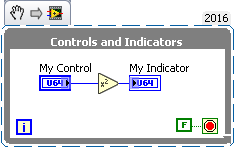
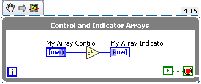
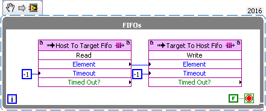
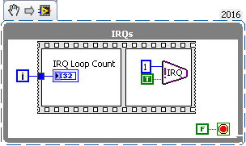

.. _basic_examples_page:

==============
Basic Examples
==============

Opening a Session
-----------------
The FPGA Interface Python API is session based. LabVIEW FPGA will generate bitfiles (.lvbitx) that can be used to program the hardware. For additional information on sessions view the API Page :ref:`api_sessions_page`.

Recommended usage is to open a Session as follows:

.. code-block:: python

   from nifpga import Session

   with Session(bitfile="MyBitfile.lvbitx", resource="RIO0") as session:
      try:
         session.run()
      except FpgaAlreadyRunningWarning:
         pass
      session.download()
      session.abort()
      session.reset()

Using Controls and Indicators
-----------------------------
Controls and indicators are used to transmit small amounts of data to and from the FPGA.  The controls and indicators accessible by the FPGA Interface Python API are from the front panel of the top level VI from the LabVIEW FPGA code that was built into the bitfile. Accessing a control or indicator is done via its unique name from :ref:`api_sessions_page`'s register property. For additional information on controls and indicators view the API page :ref:`api_registers_page`.

The following example uses this FPGA VI:

This VI will take in a value from MyControl, square it, and output it to MyIndicator.

Example Usage:

.. code-block:: python

   from nifpga import Session, FpgaAlreadyRunningWarning

   with Session("MyBitfile.lvbitx", "RIO0") as session:
       my_control = session.registers['My Control']
       my_indicator = session.registers['My Indicator']
       my_control.write(4)
       data = my_indicator.read()
       print(data)  # prints 16

Using Array Controls and Indicators
-----------------------------------
Controls and indicators can also be an array type. They work like the a non-array registers, except use a `python list <https://docs.python.org/2/tutorial/datastructures.html>`_ for reading and writing. Accessing an array control or indicator is done via its unique name from :ref:`api_sessions_page`'s register property, all controls and indicators exist in this dictionary. For additional information on array controls and indicators view the API page :ref:`api_array_registers_page`.

For the following example, we have added two arrays to our FPGA VI:

Example Usage:

.. code-block:: python

   from nifpga import Session

   with Session("MyBitfile.lvbitx", "RIO0") as session:
       my_array_control = session.registers['My Array Control']
       my_array_indicator = session.registers['My Array Indicator']

       data = [0, 1, 2, 3, 4]
       my_array_control.write(data)
       print(my_array_indicator.read())  # prints [0, 1, 4, 9, 16]

Using FIFOs
-----------
FIFOs are used for streaming data to and from the FPGA. A FIFO is accessible by the FPGA Interface Python API via the top level VI from LabVIEW FPGA code. For additional information on FIFOs view the API page :ref:`api_fifos_page`.

For the following example, we have made a VI with two FIFOs.  One FIFO is a host to target FIFO and the other is target to host FIFO.  This VI uses the FIFOs to stream data from the processor, to the FPGA and then back to the processor.

Example Usage:

.. code-block:: python

   from nifpga import Session

   # create a list of 100 incrementing values
   data = list(range(0, 100))

   with Session("MyBitfile.lvbitx", "RIO0") as session:
       host_to_target = session.fifos['Host To Target Fifo']
       target_to_host = session.fifos['Target To Host Fifo']
       host_to_target.start()
       target_to_host.start()

       # stream the data to the FPGA
       host_to_target.write(data, timeout_ms=100)
       # steam the data back to the processor
       read_value = target_to_host.read(100, timeout_ms=100)
       # read_value is a tuple containing the data and elements remaining
       print(read_value.elements_remaining)  # prints 0

       # loop over both lists and print if the data doesn't match
       for input_data, output_data in zip(data, read_value.data):
           if input_data != output_data:
               print("data error")

Using IRQs
----------

IRQs are used to generate and handle user interrupts occurring on the FPGA. IRQs are accessible through the :ref:`api_sessions_page` class. IRQs have two methods :meth:`Session.wait_on_irqs(irqs, timeout_ms)` and :meth:`Session.acknowledge_irqs(irqs)`.

For the following example, we have made a VI with an IRQ in a loop.  This will fire IRQ 1 continuously and block the loop until the user acknowledges the IRQ.

Example Usage:

.. code-block:: python

   from nifpga import Session

   timeout_ms = 300
   irq_1 = 1

   with Session("MyBitfile.lvbitx", "RIO0") as session:
       loop_count = session.registers["IRQ Loop Count"]

       # Wait on irq_1
       irq_status = session.wait_on_irqs(irq_1, timeout_ms)
       if irq_status.timed_out is True:
           print("timeout out while waiting for the interrupt")

       # Check to see if irq 1 asserted
       if irq_1 in irq_status.irqs_asserted:
           print("1 was asserted")
       else:
           print("1 was not asserted")

       # Print the loop count before and after acknowledging the irq
       print("Initial loop count:")
       print(loop_count.read())
       # Acknowledge the IRQ(s) when we're done
       session.acknowledge_irqs(irq_status.irqs_asserted)

       # Wait for the IRQ to fire again
       session.wait_on_irqs(irq_1, timeout_ms)
       # Print the loop count again to see its been incremented once
       print("Loop count after acknowledge:")
       print(loop_count.read())
